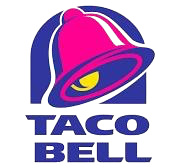
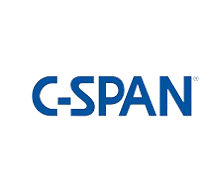

My award-winning documentary for C-SPAN StudentCam, selected among thousands of entries across the nation. Here, I focus on domestic approaches to the plastic pollution problem.
 
 
<b>Venue</b> <button style='border-radius:12px;background-color:rgb(203, 195, 227);border:none'>  Taco Bell Live Mas Conference</button> <button style='border-radius:12px;background-color:rgb(203, 195, 227);border:none'>   C-SPAN</button>
 
 
<button onclick="location.href='https://www.viddler.com/v/e470e26a'">View Video</button>
