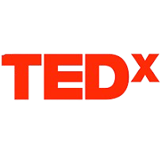

In this TEDx speech to faculty and students at the University of North Carolina, Charlotte, I lay out a novel 3-point foreign policy proposal and the foundations of an international agreement to combat plastic pollution.
Many of my proposals coincided with the positions adopted by the countries at the UN Nairobi Conference a few years later.

<b>Venue</b> <button onclick="location.href='https://www.ted.com/talks/shreyan_mitra_oceans_are_listening_our_foreign_policy_must_speak'" style='border-radius:12px;background-color:rgb(203, 195, 227);border:none'>   TEDx</button>

<button onclick="location.href='https://www.ted.com/talks/shreyan_mitra_oceans_are_listening_our_foreign_policy_must_speak'" type="button">View Talk</button>
